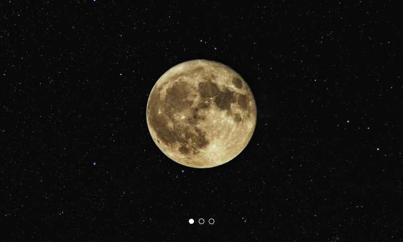

# Carousel

It is a element for cycling through elements with animation effects. All child elements will are the slides of the carousel.



## Usage

```jsx
import React from 'react';
import ReactDom from 'react-dom';
import { Carousel, Image } from '@quarkly/elements';

ReactDom.render(
    <Carousel dots height="400px" bg="black">
      <Image
        src="https://www.jpl.nasa.gov/images/mars/20160421/PIA00407-16.jpg"
        variant="fluid"
        height="400px"
      />
      <Image
        src="https://photojournal.jpl.nasa.gov/jpeg/PIA18182.jpg"
        variant="fluid"
        height="400px"
      />
      <Image
        src="https://www.jpl.nasa.gov/images/cassini/20160408/PIA11141-16.jpg"
        variant="fluid"
        height="400px"
      />
    </Carousel>
  document.getElementById('root'),
);
```

## Props

### Style props

#### Base

- variant

#### Layout

- [display / d](https://github.com/quarkly/elementary/blob/master/docs/props.md#display)
- [height / h](https://github.com/quarkly/elementary/blob/master/docs/props.md#height)
- [minHeight / mih](https://github.com/quarkly/elementary/blob/master/docs/props.md#minheight)
- [mixHeight / mah](https://github.com/quarkly/elementary/blob/master/docs/props.md#maxheight)
- [width / w](https://github.com/quarkly/elementary/blob/master/docs/props.md#width)
- [minWidth / miw](https://github.com/quarkly/elementary/blob/master/docs/props.md#minwidth)
- [maxWidth / maw](https://github.com/quarkly/elementary/blob/master/docs/props.md#maxwidth)
- [size](https://github.com/quarkly/elementary/blob/master/docs/props.md#size)

#### Spaces

- p
- pt
- pr
- pb
- pl
- px
- py
- m
- mt
- mr
- mb
- ml
- mx
- my

#### Flex

- [flex / fx](https://github.com/quarkly/elementary/blob/master/docs/props.md#flex)
- [order / ord](https://github.com/quarkly/elementary/blob/master/docs/props.md#order)

#### Grid

- [justifySelf / js](https://github.com/quarkly/elementary/blob/master/docs/props.md#justifyself)
- [alignSelf / as](https://github.com/quarkly/elementary/blob/master/docs/props.md#alignself)

#### Background

- bg
- [background / bg](https://github.com/quarkly/elementary/blob/master/docs/props.md#background-1)
- [backgroundImage / bgi](https://github.com/quarkly/elementary/blob/master/docs/props.md#backgroundimage)
- [backgroundSize / bgsz](https://github.com/quarkly/elementary/blob/master/docs/props.md#backgroundsize)
- [backgroundPosition / bgp](https://github.com/quarkly/elementary/blob/master/docs/props.md#backgroundposition)
- [backgroundRepeat / bgr](https://github.com/quarkly/elementary/blob/master/docs/props.md#backgroundrepeat)

#### Misc

- [border / bd](https://github.com/quarkly/elementary/blob/master/docs/props.md#border)
- [borderTop / bdt](https://github.com/quarkly/elementary/blob/master/docs/props.md#bordertop)
- [borderRight / bdr](https://github.com/quarkly/elementary/blob/master/docs/props.md#borderright)
- [borderBottom / bdb](https://github.com/quarkly/elementary/blob/master/docs/props.md#borderbottom)
- [borderLeft / bdl](https://github.com/quarkly/elementary/blob/master/docs/props.md#borderleft)
- [borderColor / bdc](https://github.com/quarkly/elementary/blob/master/docs/props.md#bordercolor)
- [borderRadius / bdrs](https://github.com/quarkly/elementary/blob/master/docs/props.md#borderradius)
- [opacity / op](https://github.com/quarkly/elementary/blob/master/docs/props.md#opacity)
- [boxShadow / bxsh](https://github.com/quarkly/elementary/blob/master/docs/props.md#boxshadow)
- [overflow / ov](https://github.com/quarkly/elementary/blob/master/docs/props.md#overflow)

#### Position

- [position / pos](https://github.com/quarkly/elementary/blob/master/docs/props.md#position)
- [top / t](https://github.com/quarkly/elementary/blob/master/docs/props.md#top)
- [right / r](https://github.com/quarkly/elementary/blob/master/docs/props.md#right)
- [bottom / b](https://github.com/quarkly/elementary/blob/master/docs/props.md#bottom)
- [left / l](https://github.com/quarkly/elementary/blob/master/docs/props.md#left)
- [zIndex / z](https://github.com/quarkly/elementary/blob/master/docs/props.md#zIndex)
