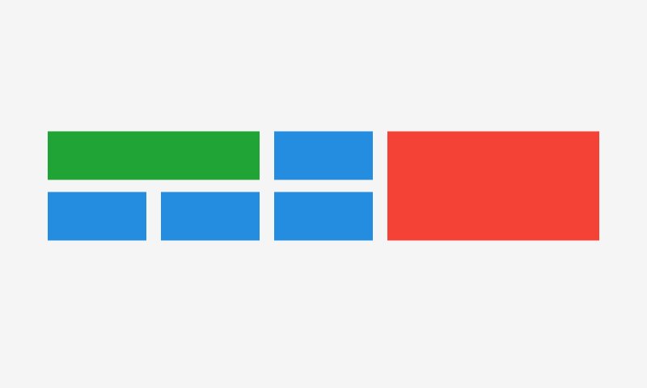

# Grid

Grids are simple containers for different tasks, e.g. to create the necessary arrangement of child elements. It is a tag `div` with display="grid" property. Grids are composite elements. They can containing other elements.



// Image 800x600 with border and white bg

## Usage

```jsx
import React from 'react';
import ReactDom from 'react-dom';
import { Grid, Text } from '@quarkly/elements';

ReactDom.render(
  <Grid width="1/2" bg="royalblue">
    <Text variant="h1" m="0" textAlign="center" color="white">
      Grid
    </Text>
  </Grid>
  document.getElementById('root'),
);
```

## Props

### Style props

#### Base

- variant

#### Layout

- display
- height
- minHeight
- maxHeight
- width
- minWidth
- maxWidth
- size

#### Spaces

- padding
- paddingTop
- paddingRight
- paddingBottom
- paddingLeft
- paddingX
- paddingY
- margin
- marginTop
- marginRight
- marginBottom
- marginLeft
- marginX
- marginY

#### Flex

- alignItems
- alignContent
- justifyItems
- justifyContent
- flexWrap
- flexBasis
- flexDirection
- flex
- order

#### Grid

- justifySelf
- alignSelf
- gridGap
- gridColumnGap
- gridRowGap
- gridColumn
- gridRow
- gridAutoFlow
- gridAutoColumns
- gridAutoRows
- gridTemplateColumns
- gridTemplateRows
- gridTemplateAreas
- gridArea

#### Background

- background
- backgroundColor
- backgroundImage
- backgroundSize
- backgroundPosition
- backgroundRepeat

#### Misc

- border
- borderTop
- borderRight
- borderBottom
- borderLeft
- borderColor
- borderRadius
- opacity
- boxShadow
- overflow

#### Position

- position
- top
- right
- bottom
- left
- zIndex
