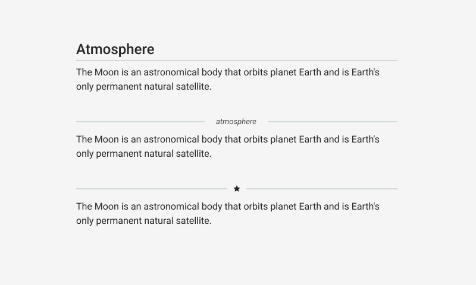

# Hr

Hrs are used to define a thematic break in content. They are rendered (on the page) as the `div` tag with border property.



## Usage

```jsx
import React from 'react';
import ReactDom from 'react-dom';
import { Hr, Text } from '@quarkly/elements';

ReactDom.render(
    <Text variant="h1" m="0" textAlign="center" color="white">
      First theme
    </Text>
    <Hr/>
    <Text variant="h1" m="0" textAlign="center" color="white">
      Second theme
    </Text>
  document.getElementById('root'),
);
```

## Props

### Style props

#### Base

- variant

#### Layout

- [display / d](https://github.com/quarkly/elementary/blob/master/docs/props.md#display)
- [height / h](https://github.com/quarkly/elementary/blob/master/docs/props.md#height)
- [minHeight / mih](https://github.com/quarkly/elementary/blob/master/docs/props.md#minheight)
- [mixHeight / mah](https://github.com/quarkly/elementary/blob/master/docs/props.md#maxheight)
- [width / w](https://github.com/quarkly/elementary/blob/master/docs/props.md#width)
- [minWidth / miw](https://github.com/quarkly/elementary/blob/master/docs/props.md#minwidth)
- [maxWidth / maw](https://github.com/quarkly/elementary/blob/master/docs/props.md#maxwidth)

#### Spaces

- [padding / p](https://github.com/quarkly/elementary/blob/master/docs/props.md#p)
- [paddingTop / pt](https://github.com/quarkly/elementary/blob/master/docs/props.md#pt)
- [paddingRight / pr](https://github.com/quarkly/elementary/blob/master/docs/props.md#pr)
- [paddingBottom / pb](https://github.com/quarkly/elementary/blob/master/docs/props.md#pb)
- [paddingLeft / pl](https://github.com/quarkly/elementary/blob/master/docs/props.md#pl)
- [paddingX / px](https://github.com/quarkly/elementary/blob/master/docs/props.md#px)
- [paddingY / py](https://github.com/quarkly/elementary/blob/master/docs/props.md#py)
- [margin / m](https://github.com/quarkly/elementary/blob/master/docs/props.md#m)
- [marginTop / mt](https://github.com/quarkly/elementary/blob/master/docs/props.md#mt)
- [marginRight / mr](https://github.com/quarkly/elementary/blob/master/docs/props.md#mr)
- [marginBottom / mb](https://github.com/quarkly/elementary/blob/master/docs/props.md#mb)
- [marginLeft / ml](https://github.com/quarkly/elementary/blob/master/docs/props.md#ml)
- [marginX / mx](https://github.com/quarkly/elementary/blob/master/docs/props.md#mx)
- [marginY / my](https://github.com/quarkly/elementary/blob/master/docs/props.md#my)

#### Background

- [background / bg](https://github.com/quarkly/elementary/blob/master/docs/props.md#background-1)

#### Misc

- [opacity / op](https://github.com/quarkly/elementary/blob/master/docs/props.md#opacity)
