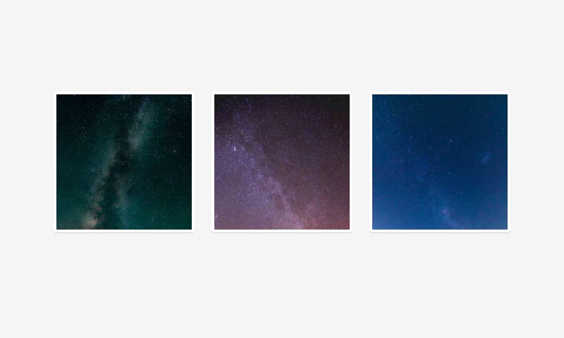

# Image

Images



// Image 800x600

## Usage

```jsx
import React from 'react';
import ReactDom from 'react-dom';
import { Image } from '@quarkly/elements';

ReactDom.render(
  <Image>
  </Image>
  document.getElementById('root'),
);
```

## Props

### Style props

#### Base

- variant
- src

#### Layout

- display
- height
- minHeight
- maxHeight
- width
- minWidth
- maxWidth
- size

#### Spaces

- padding
- paddingTop
- paddingRight
- paddingBottom
- paddingLeft
- paddingX
- paddingY
- margin
- marginTop
- marginRight
- marginBottom
- marginLeft
- marginX
- marginY

#### Flex

- flex
- order

#### Grid

- justifySelf
- alignSelf

#### Background

- background
- backgroundColor
- backgroundImage
- backgroundSize
- backgroundPosition
- backgroundRepeat

#### Misc

- border
- borderTop
- borderRight
- borderBottom
- borderLeft
- borderColor
- borderRadius
- opacity
- boxShadow
- overflow

#### Position

- position
- top
- right
- bottom
- left
- zIndex
