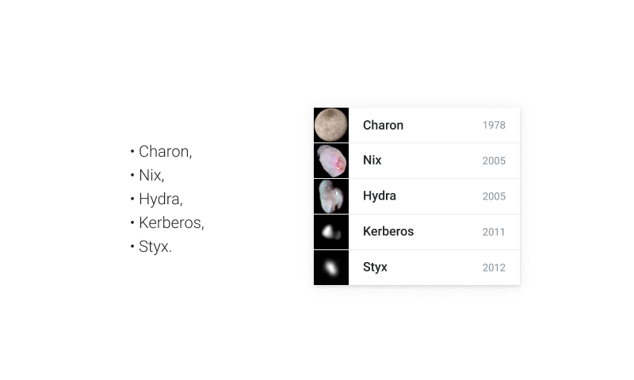

# List

Lists defines an unordered list. They use for group similar entities. It is a tag `ul`. All child elements will be wrapped in a `li` tag.



## Usage

```jsx
import React from 'react';
import ReactDom from 'react-dom';
import { List, Text } from '@quarkly/elements';

ReactDom.render(
  <List>
    <Text variant="base">
      Item 1
    </Text>
    <Text variant="base">
      Item 2
    </Text>
    <Text variant="base">
      Item 3
    </Text>
  </List>
  document.getElementById('root'),
);
```

## Props

### Style props

#### Base

- variant

#### Layout

- display / d
- height / h
- minHeight / mih
- maxHeight / mah
- width / w
- minWidth / miw
- maxWidth / maw
- size

#### Spaces

- padding / p
- paddingTop / pt
- paddingRight / pr
- paddingBottom / pb
- paddingLeft / pl
- paddingX / px
- paddingY / py
- margin / m
- marginTop / mt
- marginRight / mr
- marginBottom / mb
- marginLeft / ml
- marginX / mx
- marginY / my

#### Typography

- fontSize / fz
- color / c

#### Flex

- alignItems / ai
- alignContent / ac
- justifyItems / ji
- justifyContent / jc
- flexWrap / fxw
- flexBasis / fxb
- flexDirection / fxd
- flex / fx
- order / ord

#### Grid

- justifySelf / js
- alignSelf / as
- gridGap
- gridColumnGap
- gridRowGap
- gridColumn
- gridRow
- gridAutoFlow
- gridAutoColumns
- gridAutoRows
- gridTemplateColumns
- gridTemplateRows
- gridTemplateAreas
- gridArea

#### Background

- background / bg
- backgroundColor / bgc
- backgroundImage / bgi
- backgroundSize / bgsz
- backgroundPosition / bgp
- backgroundRepeat / bgr

#### Misc

- border / bd
- borderTop / bdt
- borderRight / bdr
- borderBottom / bdb
- borderLeft / bdl
- borderColor / bdc
- borderRadius / bdrs
- opacity / op
- boxShadow / bxsh
- overflow / ov

#### Position

- position / pos
- top / t
- right / r
- bottom / b
- left / l
- zIndex / z
