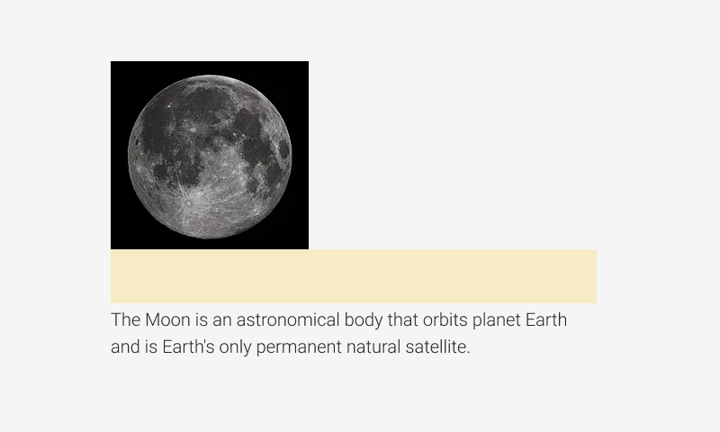

# Spacer

Spacers are used to adding extra space around elements. It is just transparent `div` tag.



## Usage

```jsx
import React from 'react';
import ReactDom from 'react-dom';
import { Spacer, Text } from '@quarkly/elements';

ReactDom.render(
  <Text variant="base">Content</Text>
  <Spacer/>
  <Text variant="base">Content</Text>
  document.getElementById('root'),
);
```

## Props

### Style props

#### Base

- variant

#### Layout

- display / d
- height / h
- minHeight / mih
- maxHeight / mah
- width / w
- minWidth / miw
- maxWidth / maw
- size

#### Spaces

- p
- pt
- pr
- pb
- pl
- px
- py
- m
- mt
- mr
- mb
- ml
- mx
- my

#### Flex

- flex / fx
- order / ord

#### Grid

- justifySelf / js
- alignSelf / as

#### Background

- bg
- background / bg
- backgroundImage / bgi
- backgroundSize / bgsz
- backgroundPosition / bgp
- backgroundRepeat / bgr

#### Misc

- border / bd
- borderTop / bdt
- borderRight / bdr
- borderBottom / bdb
- borderLeft / bdl
- borderColor / bdc
- borderRadius / bdrs
- opacity / op
- boxShadow / bxsh
- overflow / ov

#### Position

- position / pos
- top / t
- right / r
- bottom / b
- left / l
- zIndex / z
