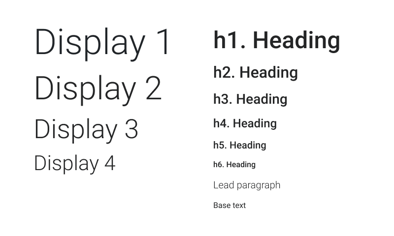

# Text

The Text element is a wrapper that will apply typography styles to the text inside. Basically, it is a tag `p`.



// Image 800x600

## Usage

```jsx
import React from 'react';
import ReactDom from 'react-dom';
import { Text } from '@quarkly/elements';

ReactDom.render(
  <Text variant="base">
    Text example
  </Text>
  document.getElementById('root'),
);
```

## Props

### Style props

#### Base

- variant

#### Layout

- display
- height
- minHeight
- maxHeight
- width
- minWidth
- maxWidth
- size

#### Spaces

- p
- pt
- pr
- pb
- pl
- px
- py
- m
- mt
- mr
- mb
- ml
- mx
- my

#### Typography

- fontSize
- color
- fontFamily
- fontWeight
- textAlign
- lineHeight
- letterSpacing

#### Flex

- flex
- order

#### Grid

- justifySelf
- alignSelf

#### Background

- bg
- background
- backgroundImage
- backgroundSize
- backgroundPosition
- backgroundRepeat

#### Misc

- border
- borderTop
- borderRight
- borderBottom
- borderLeft
- borderColor
- borderRadius
- opacity
- boxShadow
- overflow

#### Position

- position
- top
- right
- bottom
- left
- zIndex
